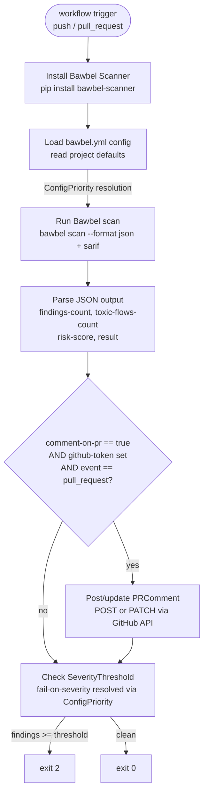

# ARCHITECTURE.md — bawbel/integrations

Update this file before closing any PR that changes component boundaries,
adds a new integration, or changes an interface between components.

---

## Component map

```
bawbel/integrations
│
├── action.yml              GitHub Action (shell + Python inline)
│   └── Depends on:         bawbel CLI (installed at runtime)
│                           bawbel.yml (optional project config)
│                           GitHub API (PR comments, SARIF upload)
│
├── vscode/                 VS Code Extension (TypeScript + Node.js)
│   └── Depends on:         bawbel CLI (installed on developer's machine)
│                           VS Code Diagnostics API
│                           PiranhaDB API (for AVE detail panel)
│
└── bawbel_hooks/           Pre-commit hooks (Python)
    └── Depends on:         bawbel CLI (installed in pre-commit venv)
```

No component imports from another.
All three share one contract: the `bawbel scan --format json` output shape.
Changes to that JSON shape must be coordinated with bawbel/scanner.

---

## GitHub Action flow



---

## ConfigPriority resolution

```
ActionInput explicit value
        ↑ overrides
bawbel.yml value
        ↑ overrides
ActionInput default
```

bawbel.yml keys → ActionInput mapping:
- scan.recursive        → recursive
- scan.fail_on_severity → fail-on-severity
- scan.format           → format
- scan.no_ignore        → no-ignore

---

## PR comment structure

```
## {icon} Bawbel Scanner

**{label}** — risk score {N}/10

|  |  |
|---|---|
| Findings | N |
| Toxic flows | N |
| Risk score | N / 10 |

| Severity | AVE ID | Title | AIVSS |
|---|---|---|---|
| {icon} CRITICAL | AVE-2026-NNNNN | title | score |
| ⛓ CRITICAL | toxic flow | title | score |

🛡 Bawbel Scanner · AVE Database · PiranhaDB
```

Comment is updated in-place on re-runs. Identified by "Bawbel Scanner"
in the comment body. One comment per PR, never duplicated.

---

## VS Code Extension architecture

```mermaid
flowchart TD
    EVENT[File event\nsave / open / change] --> SCANNER

    SCANNER[BawbelScanner\nruns: bawbel scan --format json]
    SCANNER --> |stdout JSON| PARSER

    PARSER[ResultParser\nparses BawbelFinding[]]
    PARSER --> DIAG

    DIAG[DiagnosticProvider\nconverts Finding → Diagnostic\nupdates DiagnosticCollection]
    DIAG --> |vscode.Diagnostic[]| PANEL

    PANEL[VS Code Problems Panel\ninline squiggles\nhover tooltips]

    DIAG --> STATUS
    STATUS[StatusBarItem\nclean / N finding(s) / watching / scanning]

    FINDING[Finding under cursor] --> HOVER
    HOVER[HoverProvider\nshows: AVE ID, AIVSS, match, fix link]

    FINDING --> AIVSSPANEL
    AIVSSPANEL[AIVSSPanel webview\naivss_score, evidence_stage\nconfidence_band, owasp_mcp\npiranha_url link]

    RIGHTCLICK[Right-click squiggle] --> ACCEPT
    ACCEPT[AcceptCommand\ncalls: bawbel accept ave_id file --line N]
```

---

## Pre-commit hook flow

```
git commit
    │
    ▼
pre-commit framework
    │  passes changed files as args
    ▼
bawbel_pre_commit.py
    │  calls bawbel scan on each file
    ▼
bawbel CLI
    │  returns JSON findings
    ▼
bawbel_pre_commit.py
    │  checks against fail_on_severity threshold
    ├─ findings ≥ threshold → exit 1 (commit blocked)
    └─ clean               → exit 0 (commit proceeds)
```

---

## Interface between components and bawbel/scanner

The only interface is the `bawbel` CLI output.
The JSON output shape is the contract. Changes in bawbel/scanner that
alter the JSON shape MUST be coordinated with this repo.

Fields this repo depends on:
```json
{
  "findings": [
    {
      "rule_id": "string",
      "ave_id": "string",
      "title": "string",
      "severity": "CRITICAL|HIGH|MEDIUM|LOW",
      "aivss_score": 0.0,
      "confidence": 0.0,
      "confidence_band": "high|medium|low",
      "evidence_stage": "string",
      "line": 0,
      "match": "string",
      "owasp_mcp": ["MCP01"],
      "piranha_url": "string",
      "derived": false
    }
  ],
  "toxic_flows": [
    {
      "flow_id": "string",
      "title": "string",
      "severity": "CRITICAL",
      "aivss_score": 0.0,
      "confidence": 0.0,
      "derived": true
    }
  ],
  "risk_score": 0.0,
  "findings_count": 0,
  "toxic_flows_count": 0,
  "result": "clean|findings"
}
```

If bawbel/scanner changes this shape, open an issue here and update:
- `action.yml` Python inline parser
- `vscode/src/types/BawbelFinding.ts`
- `bawbel_hooks/bawbel_pre_commit.py`

---

## ADR status

| ADR | Decision |
|---|---|
| 0001 | SARIF to Security Tab only — no code injection into repos |
| 0002 | PR comment updates in-place — no duplicate comments per PR |
| 0003 | GracefulDegradation — VS Code never crashes if bawbel not installed |
